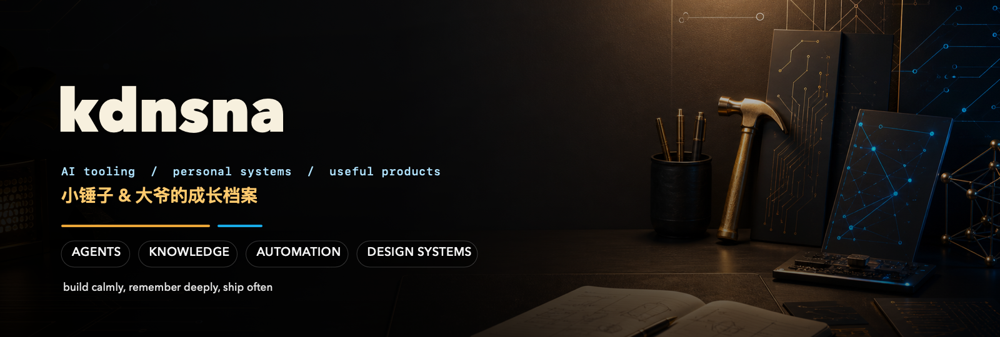

<!--
  kdnsna / GitHub Profile
  小锤子和大爷的共同成长空间
-->

<p align="center">
  
</p>

<p align="center">
  
  
  
  
</p>

<h3 align="center">把 AI、记忆系统和实用工具做成能长期陪跑的东西。</h3>

<p align="center">
  <a href="https://kdnsna.cn">Blog</a>
  ·
  <a href="https://github.com/kdnsna?tab=repositories">Repositories</a>
  ·
  <a href="https://github.com/kdnsna/kdnsna">Profile README</a>
</p>

---

## About

I'm **Kdnsna**, a builder who likes turning fuzzy ideas into tools that can actually stay useful.

Most of my work sits around three themes:

- **AI tooling**: agents, skills, workflow glue, and better ways to work with coding assistants
- **Personal systems**: memory, notes, automation, and long-running companion workflows
- **Useful products**: small but complete tools, from dashboards to wedding navigation to presentation engines

我是 **Kdnsna**。我喜欢把模糊想法拆成清晰系统，再一点点做成能长期使用的工具。<br>
这里也是「小锤子 & 大爷」一起长出来的工作台。

---

## Featured Builds

| Project | What it is | Stack |
| --- | --- | --- |
| [ultimate-ppt-master-skill](https://github.com/kdnsna/ultimate-ppt-master-skill) | Editable PPTX and magazine-style web deck generation from source material | Python |
| [wedding-navigator](https://github.com/kdnsna/wedding-navigator) | A wedding-day action guide with invitation, routes, RSVP, schedule, and blessing wall | Vue / uni-app |
| [my-blog](https://github.com/kdnsna/my-blog) | The digital home for notes, projects, and the ongoing human + AI companion story | TypeScript |
| [openclaw-dashboard](https://github.com/kdnsna/openclaw-dashboard) | Real-time dashboard for sessions, usage, cost tracking, and mobile monitoring | TypeScript |
| [project-20260421-195043](https://github.com/kdnsna/project-20260421-195043) | A focused certificate-of-deposit calculator experience | TypeScript |
| [cd-calculator](https://github.com/kdnsna/cd-calculator) | Lightweight static calculator experiment | HTML |

---

## Toolbox

```text
Languages      TypeScript / JavaScript / Python / Shell / Vue
AI & agents    Codex / Claude / OpenClaw / WorkBuddy / MCP / custom skill workflows
Frontend       Vue / Nuxt / Vite / uni-app / responsive product UI
Automation     GitHub Actions / macOS local workflows / CLI-first utilities
Interests      memory systems / developer experience / personal knowledge tools
```

---

## Current Direction

- Building AI workflows that remember context, survive real daily use, and stay pleasant to operate
- Turning presentation, design, and delivery work into reusable skills instead of one-off labor
- Keeping personal software small, clear, and shippable
- Exploring companion-style systems where tools feel less like commands and more like capable collaborators

---

## Find Me

- Blog: [kdnsna.cn](https://kdnsna.cn)
- GitHub: [@kdnsna](https://github.com/kdnsna)
- Companion workspace: 小锤子, WorkBuddy, OpenClaw, and a growing pile of careful experiments

---

<p align="center">
  <sub>Last refreshed: 2026-05-20</sub>
</p>

<!-- profile-end -->
