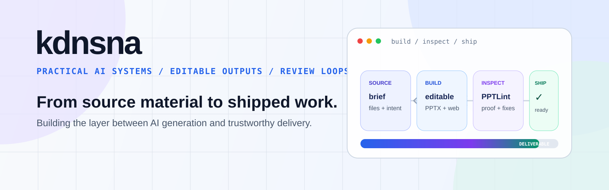

<!-- kdnsna / GitHub Profile · refreshed 2026-07-13 -->

<p align="center">
  
</p>

<p align="center">
  <a href="https://github.com/kdnsna/pptlint"></a>
  <a href="https://github.com/kdnsna/ultimate-ppt-master-skill"></a>
  
  
</p>

<p align="center">
  <strong>把 AI 从“生成一下”推进到“真的能交付”。</strong><br/>
  I build practical AI systems with editable outputs, review loops, and evidence you can inspect.
</p>

<p align="center">
  <a href="https://kdnsna.cn">Blog</a> ·
  <a href="https://github.com/kdnsna?tab=repositories">Projects</a> ·
  <a href="https://kdnsna.github.io/pptlint/">Try PPTLint</a> ·
  <a href="https://kdnsna.github.io/ultimate-ppt-master-skill/">PPT Workspace</a>
</p>

---

## Now / 现在

我最近在搭一条更完整的 **AI 演示文稿交付链**：先把模糊需求和本地资料变成可编辑成稿，再用独立检查器发现那些“看起来能打开、实际不能放心交”的问题。

```text
source material  →  clarify & structure  →  editable PPTX / Web Deck  →  inspect  →  ship
        Ultimate PPT Master v6.1.0                          PPTLint v1.3.0
```

<table>
  <tr>
    <td width="50%" valign="top">
      <h3>🔎 <a href="https://github.com/kdnsna/pptlint">PPTLint</a></h3>
      <p><strong>Open-source quality gate for PPT/PPTX delivery.</strong></p>
      <p>检查 AI 生成或人工制作的演示文稿，在汇报、分享和交付前定位会真正影响使用的问题。</p>
      <p>
        <a href="https://kdnsna.github.io/pptlint/"><strong>Live site →</strong></a> ·
        <a href="https://github.com/kdnsna/pptlint/releases/latest">v1.3.0</a>
      </p>
    </td>
    <td width="50%" valign="top">
      <h3>✦ <a href="https://github.com/kdnsna/ultimate-ppt-master-skill">Ultimate PPT Master</a></h3>
      <p><strong>From rough brief to editable, reviewable deck.</strong></p>
      <p>先问清受众、场景和风格，再整理本地资料，生成 PPTX / Web Deck，并通过渲染审阅和审计留痕守住成稿质量。</p>
      <p>
        <a href="https://kdnsna.github.io/ultimate-ppt-master-skill/"><strong>Web experience →</strong></a> ·
        <a href="https://github.com/kdnsna/ultimate-ppt-master-skill/releases/latest">v6.1.0</a>
      </p>
    </td>
  </tr>
</table>

## Selected Systems / 代表作品

| Project | Product idea | Built with |
| --- | --- | --- |
| [PPTLint](https://github.com/kdnsna/pptlint) | 为 PPT/PPTX 建立独立、可复现的交付前质量检查 | Python · HTML · GitHub Actions |
| [Ultimate PPT Master](https://github.com/kdnsna/ultimate-ppt-master-skill) | 把一句话需求、本地资料和审阅闭环组织成演示文稿生产工作台 | Python · Node.js · Web |
| [Wedding Navigator](https://github.com/kdnsna/wedding-navigator) | 从请柬、路线、日程、回执到主人端管理的婚礼全流程小程序 | Vue · uni-app · CloudBase |
| [Formula Price Manager](https://github.com/kdnsna/formula-price-manager) | 把散落在表格里的定价公式、月度变更和版本记录变成可维护工具 | TypeScript · Vite · Excel |
| [My Blog](https://github.com/kdnsna/my-blog) | 让项目笔记、长期写作和公开构建记录在冲刺结束后仍然可查 | TypeScript |

## How I Build / 我的工作方式

- **Local-first by default** — 涉及真实业务资料时，优先让源文件和交付物留在用户可控环境里。
- **Editable beats impressive** — 不只展示结果；文本、表格、公式和结构都应该能继续修改。
- **Evidence before confidence** — 用渲染结果、检查报告、测试和发布记录说明“为什么可以交”。
- **Small tools, complete loops** — 再窄的工具，也应该有清晰入口、错误边界、诊断与交接路径。

## Working Stack / 常用技术

```text
Product & UI     TypeScript · JavaScript · Vue · Vite · uni-app
Automation       Python · Shell · GitHub Actions · macOS workflows
AI systems       Codex · MCP · custom skills · local agents · review loops
Deliverables     PPTX · Web Deck · Markdown · Excel · mini programs
```

<p align="center">
  <sub>Currently exploring the space between AI generation and trustworthy delivery.</sub><br/>
  <sub>Jinan, China · Updated 2026-07-13</sub>
</p>

<!-- profile-end -->
